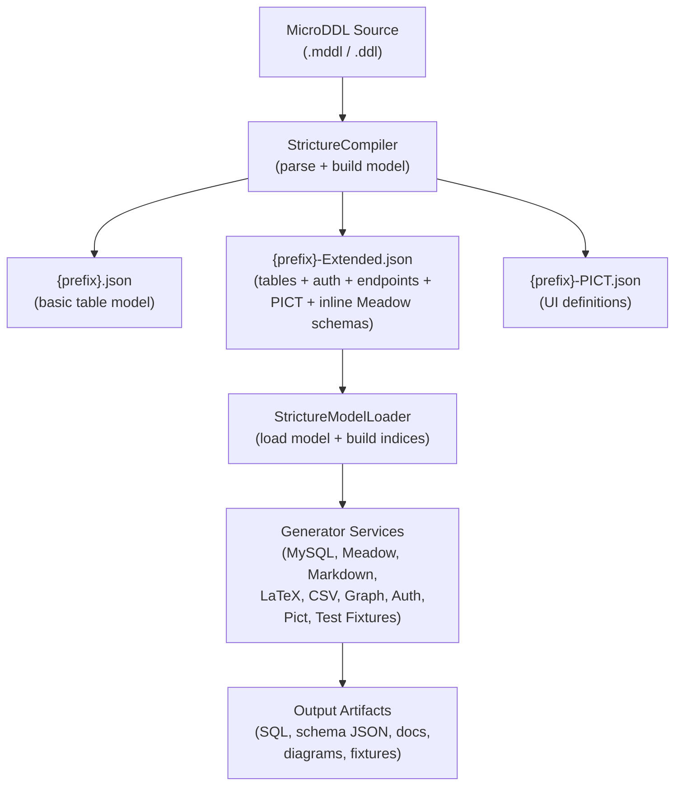
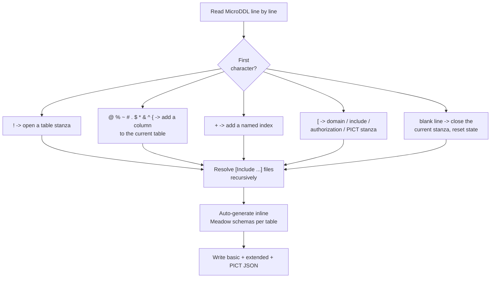
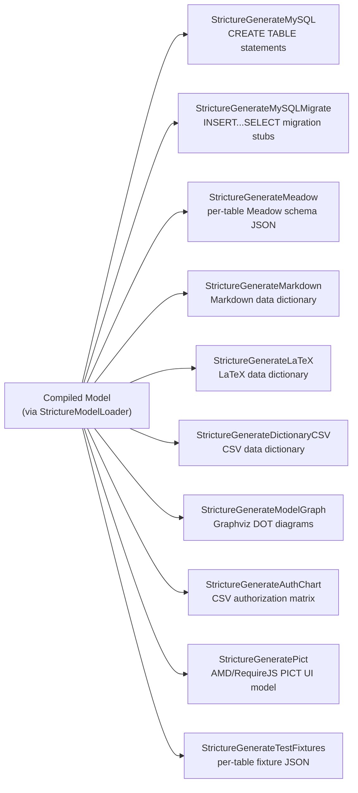
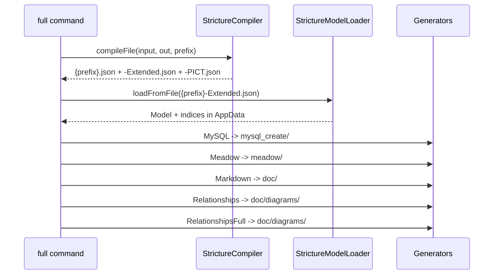
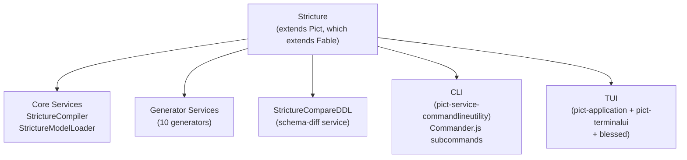

# Architecture

Stricture is a MicroDDL compiler and multi-target schema code generator. It
turns a compact, line-oriented schema definition into JSON models, MySQL DDL,
Meadow schemas, documentation, relationship diagrams and test fixtures. This
document describes the compile pipeline, the generator services, the v1/v2 to
v3 relationship, and where generated artifacts are written.

## The Two-Phase Pipeline

Stricture uses a two-phase approach. First, the **compiler** parses MicroDDL
text into an intermediate JSON model. Second, one or more **generators** read
that model and emit output artifacts. The `full` command chains both phases in
a single pass.



The compiler always writes three JSON files. Generators read a compiled JSON
model -- almost always the `-Extended.json` model, which carries the
authorization rules, endpoint definitions, PICT configuration and inline Meadow
schemas the generators depend on.

## Why a Separate Model File

The intermediate model is the contract between the compiler and every
generator. Parsing MicroDDL once and persisting the result means generators
never re-parse text -- they consume a stable, indexed object graph. It also
lets you commit the compiled model to source control, point a generator at a
model someone else compiled, or re-run a single generator without recompiling.

The JSON model format is stable across major versions. Stricture v3/v4 reads
and writes the same `{prefix}.json`, `{prefix}-Extended.json` and
`{prefix}-PICT.json` files that earlier releases produced.

## Compiler Internals

The compiler (`StrictureCompiler`) is a single-pass, line-oriented parser. Each
line is dispatched on its first character (see the
[MicroDDL Syntax](MicroDDL-Syntax.md) reference for the full symbol table).



The parser tracks a small amount of state as it goes -- the current table
scope, the current stanza type (table, authorization, or one of the PICT view
types), and the current domain. A blank line closes the open stanza and resets
that state. `[Include ...]` directives are resolved recursively, relative to
the directory of the file that declared them, after the main file is parsed.
Once parsing finishes, the compiler walks every table and synthesizes an inline
Meadow schema (scope, default identifier, schema array, default object and JSON
schema), which it embeds in the extended model.

## Output Generators

Each output target is a standalone Fable service. They share a common shape:
the model is loaded via `StrictureModelLoader`, then the generator's
`generate(pOptions, fCallback)` method reads `this.fable.AppData.Model` (and the
join indices) and writes its artifacts. Because each generator is independent,
you can run exactly the ones you need, in any order, against a previously
compiled model.



### SQL Generation

The SQL generators target **MySQL**. `StrictureGenerateMySQL` emits a single
`.mysql.sql` file containing a `CREATE TABLE IF NOT EXISTS` statement per table,
mapping each MicroDDL type to a MySQL column definition and using
`utf8mb4` / `utf8mb4_unicode_ci`. `StrictureGenerateMySQLMigrate` emits
`INSERT...SELECT` migration stubs for moving data between schema versions. See
[MySQL DDL](Command-MySQL.md) and [MySQL Migrate](Command-MySQL-Migrate.md) for
the column-type mappings and output format.

Stricture itself does not ship a Postgres or MSSQL DDL generator. Cross-engine
differences (for example, how a JSON column is physically stored, or how soft
deletes are filtered) are handled downstream by the Meadow provider layer at
runtime, not by a Stricture generator -- the same Meadow schema drives every
supported database engine. See [Meadow](https://fable-retold.github.io/meadow/)
for the engine-specific provider behavior.

### Meadow Schemas

`StrictureGenerateMeadow` writes one Meadow schema JSON file per table, named
`{prefix}{TableName}.json` (for example `MeadowSchemaUser.json`). Each file
contains the `Scope`, `DefaultIdentifier`, `Schema` array, `DefaultObject` and a
JSON Schema, plus the per-table `Authorization` block when the input is an
extended model. These files load directly into a Meadow data access layer. See
[Meadow Schemas](Command-Meadow.md) for the type mappings and file structure.

### Documentation, Diagrams and Fixtures

The remaining generators produce review and tooling artifacts:

| Service | Command | Output |
|---|---|---|
| `StrictureGenerateMarkdown` | `documentation` (`doc`) | Markdown data dictionary (`Dictionary.md`, per-table `Model-*.md`, change-tracking matrix) |
| `StrictureGenerateLaTeX` | `data-dictionary` (`dd`) | LaTeX data dictionary for printable docs |
| `StrictureGenerateDictionaryCSV` | `dictionary-csv` (`csv`) | Spreadsheet-friendly CSV dictionary |
| `StrictureGenerateModelGraph` | `relationships` (`rel`) / `relationships-full` (`relf`) | Graphviz DOT relationship diagrams (optional PNG) |
| `StrictureGenerateAuthChart` | `authorization` (`auth`) | CSV role/permission matrix |
| `StrictureGeneratePict` | `pict` | AMD/RequireJS PICT UI model |
| `StrictureGenerateTestFixtures` | `test-fixtures` (`tf`) | Per-table fixture JSON (25 objects per table) |

The relationship diagram generator runs in two modes: `relationships` excludes
the ubiquitous audit-user joins (`CreatingIDUser`, `UpdatingIDUser`,
`DeletingIDUser`) for a cleaner domain view, while `relationships-full` includes
them. PNG compilation requires Graphviz to be installed. See
[Relationships](Command-Relationships.md) and
[Authorization](Command-Authorization.md) for details.

## The `full` Pipeline

The `full` command is the end-to-end build. It compiles the MicroDDL, loads the
extended model, and then runs a fixed sequence of generators, writing each
target into its own subdirectory.



`full` does not run every generator. LaTeX, CSV dictionary, authorization,
PICT, MySQL-migrate and test-fixtures are run as separate commands when needed.
See [Full Pipeline](Command-Full.md) for the complete stage list and output
tree.

## Generated Artifact Layout

A compile writes three files to the output directory. A full pipeline run adds
per-target subdirectories beneath it:

```
{OutputLocation}/
  {prefix}.json                                  # basic table model
  {prefix}-Extended.json                         # full model (auth + endpoints + PICT + Meadow schemas)
  {prefix}-PICT.json                             # PICT UI definitions
  mysql_create/
    MeadowModel-CreateMySQLDatabase.mysql.sql    # CREATE TABLE statements
  meadow/
    MeadowSchema{TableName}.json                 # one per table
  doc/
    Documentation-Dictionary.md
    Documentation-Model-{TableName}.md           # one per table
    Documentation-ModelChangeTracking.md
    diagrams/
      Relationships.dot
      Relationships.png                          # only when -g is supplied and Graphviz is installed
      RelationshipsFull.dot
      RelationshipsFull.png
```

The default `OutputLocation` is `./model/` and the default file prefix is
`MeadowModel`; both are configurable per command and via the cascading config
file.

## Service-Oriented Architecture

Stricture 3.0 was a complete modernization onto the Pict/Fable 3.x service
provider pattern, carried forward in the current 4.x line. The module export
extends Pict (which extends Fable) and registers every compiler stage and
generator as a named service type. The same service types are also registered
on the CLI program instance.



The registered service types are:

| Service Type | Purpose |
|---|---|
| `StrictureCompiler` | Compile MicroDDL to JSON model files |
| `StrictureModelLoader` | Load a compiled model and build index lookups |
| `StrictureGenerateMySQL` | MySQL `CREATE TABLE` statements |
| `StrictureGenerateMySQLMigrate` | MySQL `INSERT...SELECT` migration stubs |
| `StrictureGenerateMeadow` | Per-table Meadow schema JSON files |
| `StrictureGenerateMarkdown` | Markdown data dictionary documentation |
| `StrictureGenerateLaTeX` | LaTeX data dictionary documentation |
| `StrictureGenerateDictionaryCSV` | CSV data dictionary |
| `StrictureGenerateModelGraph` | Graphviz DOT relationship diagrams |
| `StrictureGenerateAuthChart` | CSV authorization/permission matrix |
| `StrictureGeneratePict` | AMD/RequireJS PICT UI model |
| `StrictureGenerateTestFixtures` | Per-table test fixture JSON files |
| `StrictureCompareDDL` | Compare two compiled models and report schema differences |

Each service extends `fable-serviceproviderbase` and shares state through
`this.fable.AppData`:

- `AppData.Model` -- the compiled table model
- `AppData.ModelIndices` -- primary-key column to table-name lookup
- `AppData.ExtendedModel` -- flag for extended versus basic model
- `AppData.Stricture` -- raw compiler output

## Three Ways to Drive It

Stricture exposes the same service layer through three front ends:

1. **Programmatic API** -- `require('stricture')` returns a constructor that, on
   `new`, registers all service types. Instantiate services with
   `instantiateServiceProvider('StrictureCompiler')` and call them directly.
   This is the integration path for build scripts and pipelines.
2. **CLI** -- `bin/stricture` loads the CLI program built on
   [pict-service-commandlineutility](https://fable-retold.github.io/pict-service-commandlineutility/),
   which registers a Commander.js subcommand per generator plus `info`, `tui`
   and a built-in `explain-config` command. Configuration cascades from
   built-in defaults, then `~/.stricture-config.json`, then
   `./.stricture-config.json`.
3. **Interactive TUI** -- `stricture tui Model.mddl` launches a blessed-based
   terminal UI (a `pict-application` driving
   [pict-terminalui](https://fable-retold.github.io/pict-terminalui/) views)
   for browsing tables, inspecting columns and previewing generated DDL.

## v1/v2 to v3 Compiler Relationship

The legacy `yargs`-based CLI (`stricture -i Model.mddl -c Full`) was replaced in
v3 by Commander subcommands (`stricture full Model.mddl`). The legacy compiler
sources remain in the repository under `source/legacy/` and are still reachable
through the CLI for backward compatibility; see the
[Legacy Compiler](Stricture-Legacy-Compiler.md) reference for the old flag set
and command names. Both the legacy and modern compilers emit the same JSON
model format, so models compiled by either are interchangeable across the
generators.

## Related Modules

- [Meadow](https://fable-retold.github.io/meadow/) -- the data access layer that
  consumes Stricture's generated schemas
- [FoxHound](https://fable-retold.github.io/foxhound/) -- the query DSL Meadow
  uses to turn schemas into SQL
- [Pict](https://fable-retold.github.io/pict/) -- the application and view
  framework Stricture is built on, and the target of the PICT UI generator
- [pict-service-commandlineutility](https://fable-retold.github.io/pict-service-commandlineutility/)
  -- the CLI framework powering Stricture's subcommands
